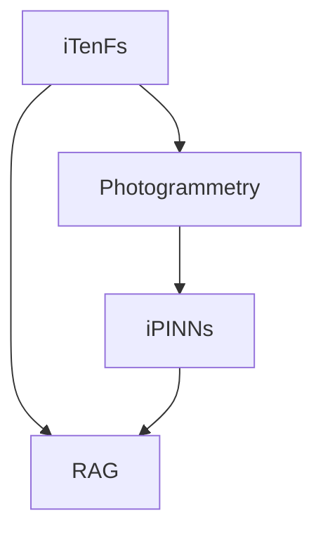

# 🚀 Research OS 導入ガイド
## GitHub + Markdown + MkDocs + GitHub Pages による研究開発チームの Docs-as-Code 基盤

---

# 0. このドキュメントの目的 🎯

本ドキュメントは、研究開発チームのための **Knowledge Repository / Engineering Handbook / Research OS** を、  
**GitHub + Markdown + MkDocs + GitHub Pages** で構築するための実践ガイドです。

対象は、以下のようなチームです。

- 🧠 複数の研究開発テーマを横断して運営する
- 🤖 ドキュメントの作成・更新を AI にも担ってほしい
- 📝 SSOT（Single Source of Truth）を Git で管理したい
- 🌐 新メンバーがブラウザから気軽に参照できるようにしたい
- 🔍 設計思想、PR作法、Git運用、技術地図、オンボーディングを一元管理したい

想定プロジェクト例:

- iTenFs
- Photogrammetry
- iPINNs
- RAG

---

# 1. 結論 🧭

研究開発チームの文書基盤として、以下を採用します。

- **GitHub**: 履歴管理・レビュー・共有基盤
- **Markdown**: AI が最も扱いやすい文書形式
- **Mermaid**: 図のテキスト管理
- **MkDocs**: Markdown 群を docs サイトに変換
- **GitHub Pages**: docs サイトのホスティング

つまり、思想としてはこれです。

> **Docs as Code**
>
> ドキュメントもコードと同じように、
> - バージョン管理し
> - Pull Request でレビューし
> - 差分を追跡し
> - いつでも巻き戻し可能にする

---

# 2. なぜこの構成が適しているのか 💡

## 2.1 要件との対応表

| 要件 | 必要な性質 | 採用技術 |
|---|---|---|
| SSOT | 履歴が残る | GitHub |
| AI編集 | プレーンテキスト | Markdown |
| 図表 | テキストで保守可能 | Mermaid |
| 閲覧性 | ブラウザで見やすい | MkDocs + GitHub Pages |
| 長期保守 | ツール依存を避ける | Git + Markdown |
| オンボーディング | 入口が一つ | Research OS repo |
| 方針更新 | 差分で更新しやすい | Git PR 運用 |

---

# 3. リポジトリ分離の基本方針 🗂️

## 3.1 重要な原則

**Docs 管理 repo と、コードベースの各プロジェクト repo は分ける。**

### なぜ分けるのか？

理由は明確です。

### ✅ 分けるべきもの
- チーム横断の思想
- Git / PR / ブランチ戦略
- コミット粒度の哲学
- 会議方針
- オンボーディング
- 技術ポートフォリオ全体像
- 研究テーマ間の位置づけ

### ✅ 各プロジェクト repo に置くべきもの
- 実装に密接した設計
- API仕様
- 実験コード
- Build / Run 手順
- プロジェクト固有 ADR
- プロジェクト固有 TODO / backlog

---

## 3.2 推奨構成

### 横断 repo
- `research-os`

### 個別 repo
- `itenfs`
- `photogrammetry`
- `ipinns`
- `rag`

---

# 4. Research OS の役割 🧠

Research OS repo は、単なる docs 置き場ではありません。

これはチームにとっての

- 📘 Handbook
- 🧭 Operating System
- 🏛️ 憲法
- 🧩 横断SSOT
- 🤖 AIが読む前提の知識基盤

です。

---

# 5. 完成形ディレクトリ構造（推奨版） 🏗️

以下が、かなり実用的な **完成形に近い構造** です。

```text
research-os/
├── README.md
├── mkdocs.yml
├── .gitignore
├── .github/
│   └── workflows/
│       └── deploy-pages.yml
├── docs/
│   ├── index.md
│   ├── philosophy/
│   │   ├── engineering-philosophy.md
│   │   ├── ai-engineering-os.md
│   │   ├── determinism-and-reproducibility.md
│   │   └── docs-as-code.md
│   ├── team/
│   │   ├── onboarding.md
│   │   ├── roles-and-responsibilities.md
│   │   ├── meeting-policy.md
│   │   └── communication-guidelines.md
│   ├── development/
│   │   ├── git-strategy.md
│   │   ├── branching-strategy.md
│   │   ├── commit-granularity.md
│   │   ├── pr-rules.md
│   │   ├── review-policy.md
│   │   └── coding-and-documentation-standards.md
│   ├── research/
│   │   ├── portfolio-map.md
│   │   ├── technical-roadmap.md
│   │   ├── experiment-policy.md
│   │   └── knowledge-curation-policy.md
│   ├── projects/
│   │   ├── itenfs.md
│   │   ├── photogrammetry.md
│   │   ├── ipinns.md
│   │   └── rag.md
│   ├── decisions/
│   │   ├── adr-001-repo-policy.md
│   │   ├── adr-002-docs-policy.md
│   │   ├── adr-003-git-strategy.md
│   │   └── adr-004-ai-editing-policy.md
│   ├── templates/
│   │   ├── adr-template.md
│   │   ├── meeting-note-template.md
│   │   ├── project-summary-template.md
│   │   └── experiment-note-template.md
│   ├── glossary/
│   │   └── terms.md
│   └── assets/
│       └── images/
└── scripts/
    └── validate-docs.sh
```

---

# 6. 最低限の初期ファイル一覧 ✅

最初から全部作る必要はありません。  
まずは以下だけで十分スタートできます。

## 最小スタートセット

- `README.md`
- `mkdocs.yml`
- `docs/index.md`
- `docs/team/onboarding.md`
- `docs/development/git-strategy.md`
- `docs/development/commit-granularity.md`
- `docs/development/pr-rules.md`
- `docs/research/portfolio-map.md`
- `docs/projects/itenfs.md`
- `docs/projects/photogrammetry.md`
- `docs/projects/ipinns.md`
- `docs/projects/rag.md`
- `docs/decisions/adr-001-repo-policy.md`

---

# 7. 各ファイルに何を書くか ✍️

## 7.1 `README.md`

役割:
- repoの入口
- 目的説明
- ローカル起動方法
- 編集方針
- docs site URL へのリンク

入れるべき内容:
- Research OS とは何か
- どの情報がここにあるのか
- 各プロジェクト repo との関係
- MkDocs ローカルプレビュー方法
- docs 変更時の PR ルール

---

## 7.2 `docs/index.md`

役割:
- docs サイトのトップページ

入れるべき内容:
- チームのミッション
- 研究テーマ一覧
- 重要ドキュメントへの導線
- 新メンバー向け入口

---

## 7.3 `docs/team/onboarding.md`

役割:
- 新メンバーが最初に読む文書

入れるべき内容:
- チームの目的
- 現在の重点プロジェクト
- 使用ツール
- Git / PR の基本
- どの docs から読むべきか
- 参加初週にやること

---

## 7.4 `docs/development/git-strategy.md`

役割:
- Git運用の原則定義

入れるべき内容:
- ブランチ命名規則
- main / develop 運用有無
- squash merge の方針
- docs 更新の扱い
- force push の扱い
- release tag の考え方

---

## 7.5 `docs/development/commit-granularity.md`

役割:
- コミット粒度の思想の明文化

入れるべき内容:
- 1コミット1意図
- レビュー可能性重視
- 可逆性重視
- 仕様変更とリファクタの分離
- ドキュメント更新をどう混ぜるか

---

## 7.6 `docs/development/pr-rules.md`

役割:
- PR作法の明文化

入れるべき内容:
- PR のサイズ目安
- タイトル規約
- 説明テンプレート
- 変更理由の書き方
- スクリーンショット / Mermaid / 図の扱い
- レビュー依頼の粒度

---

## 7.7 `docs/research/portfolio-map.md`

役割:
- チーム全体の研究開発地図

入れるべき内容:
- iTenFs
- Photogrammetry
- iPINNs
- RAG
- 各テーマの相互関係
- 事業寄与 / 技術寄与 / 学習価値

---

## 7.8 `docs/projects/*.md`

役割:
- 各プロジェクトの位置づけ整理

入れるべき内容:
- 目的
- なぜやるか
- 技術スタック
- チーム内での意味
- 他プロジェクトとの接続点
- 今後の課題

---

## 7.9 `docs/decisions/*.md`

役割:
- 意思決定履歴の保存

この系列は極めて重要です。  
後から「なぜそのツールを選んだのか」を追えるようにします。

---

# 8. ADR（Architecture Decision Record）の採用 🏛️

## 8.1 ADRとは？

技術選定や運用方針の決定について、  
**「何を」「なぜ」選んだか」** を短い文書で記録する仕組みです。

---

## 8.2 ADR を入れるメリット

- 🙋 新メンバーが背景を理解しやすい
- 🔁 同じ議論の再発を減らせる
- 🧠 AI に背景込みで編集させやすい
- 📜 思想と実務の接続が明確になる

---

## 8.3 ADR テンプレート例

```md
# ADR-001: Use GitHub + Markdown + MkDocs + GitHub Pages

## Status
Accepted

## Context
研究開発チーム横断のSSOTが必要である。
AIが編集しやすく、履歴管理が可能で、長期保守に耐える文書基盤が求められる。

## Decision
以下を採用する。
- GitHub
- Markdown
- MkDocs
- GitHub Pages

## Consequences
### Positive
- Docs as Code が成立する
- AI編集と人間レビューの相性が良い
- ベンダーロックインが少ない

### Negative
- 初期セットアップがやや必要
- Notionのような即時共同編集体験は弱い
```

---

# 9. Mermaid の使い方 📊

Mermaid は図をテキストで表現できるため、Research OS と非常に相性が良いです。

## 9.1 使いどころ

- 技術ポートフォリオ地図
- プロジェクト関係図
- Onboarding flow
- 意思決定フロー
- 研究テーマの依存関係

---

## 9.2 例: 研究テーマ地図



---

# 10. MkDocs 導入手順 🛠️

ここから実践です。

---

## 10.1 前提

以下が使える前提で進めます。

- Git
- GitHub アカウント
- Python
- pip

---

## 10.2 リポジトリを作成

GitHub 上で新規 repo を作成します。

推奨名:

- `research-os`
- `research-handbook`
- `engineering-handbook`

おすすめは **`research-os`** です。

---

## 10.3 ローカルに clone

```bash
git clone git@github.com:YOUR-ORG/research-os.git
cd research-os
```

---

## 10.4 MkDocs をインストール

```bash
pip install mkdocs
```

必要に応じて仮想環境を使います。

```bash
python -m venv .venv
source .venv/bin/activate
pip install mkdocs
```

---

## 10.5 初期プロジェクト作成

空 repo にそのまま作るなら、手動で構成してもよいですが、  
初期雛形を作るなら以下でもOKです。

```bash
mkdocs new temp-docs
```

ただし、既存 repo に組み込むなら、通常は `docs/` と `mkdocs.yml` を自分で整える方が綺麗です。

---

## 10.6 初期ファイル作成

```bash
mkdir -p docs/philosophy
mkdir -p docs/team
mkdir -p docs/development
mkdir -p docs/research
mkdir -p docs/projects
mkdir -p docs/decisions
mkdir -p docs/templates
mkdir -p docs/glossary
mkdir -p docs/assets/images
mkdir -p .github/workflows
mkdir -p scripts
```

---

## 10.7 `mkdocs.yml` の初期例

```yaml
site_name: Research OS
site_description: Research and Development Team Knowledge Repository
site_url: https://YOUR-ORG.github.io/research-os/

theme:
  name: mkdocs

nav:
  - Home: index.md
  - Philosophy:
      - Engineering Philosophy: philosophy/engineering-philosophy.md
      - AI Engineering OS: philosophy/ai-engineering-os.md
      - Determinism and Reproducibility: philosophy/determinism-and-reproducibility.md
      - Docs as Code: philosophy/docs-as-code.md
  - Team:
      - Onboarding: team/onboarding.md
      - Roles and Responsibilities: team/roles-and-responsibilities.md
      - Meeting Policy: team/meeting-policy.md
      - Communication Guidelines: team/communication-guidelines.md
  - Development:
      - Git Strategy: development/git-strategy.md
      - Branching Strategy: development/branching-strategy.md
      - Commit Granularity: development/commit-granularity.md
      - PR Rules: development/pr-rules.md
      - Review Policy: development/review-policy.md
      - Coding and Documentation Standards: development/coding-and-documentation-standards.md
  - Research:
      - Portfolio Map: research/portfolio-map.md
      - Technical Roadmap: research/technical-roadmap.md
      - Experiment Policy: research/experiment-policy.md
      - Knowledge Curation Policy: research/knowledge-curation-policy.md
  - Projects:
      - iTenFs: projects/itenfs.md
      - Photogrammetry: projects/photogrammetry.md
      - iPINNs: projects/ipinns.md
      - RAG: projects/rag.md
  - Decisions:
      - ADR-001 Repo Policy: decisions/adr-001-repo-policy.md
      - ADR-002 Docs Policy: decisions/adr-002-docs-policy.md
      - ADR-003 Git Strategy: decisions/adr-003-git-strategy.md
      - ADR-004 AI Editing Policy: decisions/adr-004-ai-editing-policy.md
  - Glossary:
      - Terms: glossary/terms.md
```

---

## 10.8 ローカルプレビュー

```bash
mkdocs serve
```

その後、ブラウザで確認します。

```text
http://127.0.0.1:8000
```

---

## 10.9 静的サイトのビルド

```bash
mkdocs build
```

これで `site/` ディレクトリに静的サイトが生成されます。

---

# 11. GitHub Pages の使い方 🌐

GitHub Pages は、GitHub リポジトリを静的サイトとして公開する仕組みです。

MkDocs と組み合わせる場合、運用は大きく2つあります。

- 方式A: `gh-pages` ブランチへ公開
- 方式B: GitHub Actions で build & deploy

---

## 11.1 どちらを採用すべきか？

### 推奨:
**方式B: GitHub Actions**

理由:
- build 結果を手元で持たなくてよい
- CI/CD 化できる
- main ブランチの Markdown を元に毎回デプロイできる
- docs-as-code 運用と相性が良い

---

## 11.2 方式A: `mkdocs gh-deploy`

最速で試したい場合はこれです。

```bash
mkdocs gh-deploy
```

これで build した内容が `gh-pages` ブランチへ push されます。

### メリット
- 早い
- 単純
- 小規模なら十分

### デメリット
- CI/CD 感は弱い
- ローカルから deploy する前提が入る
- チーム運用では Actions より一貫性に欠けやすい

---

## 11.3 方式B: GitHub Actions（推奨）

### 目的
`main` にマージされたら、自動で docs site を更新する。

---

## 11.4 GitHub Actions ワークフロー例

`.github/workflows/deploy-pages.yml`

```yaml
name: Deploy MkDocs to GitHub Pages

on:
  push:
    branches:
      - main

permissions:
  contents: read
  pages: write
  id-token: write

concurrency:
  group: pages
  cancel-in-progress: true

jobs:
  build:
    runs-on: ubuntu-latest
    steps:
      - name: Checkout
        uses: actions/checkout@v4

      - name: Setup Python
        uses: actions/setup-python@v5
        with:
          python-version: "3.11"

      - name: Install MkDocs
        run: pip install mkdocs

      - name: Build site
        run: mkdocs build

      - name: Upload artifact
        uses: actions/upload-pages-artifact@v3
        with:
          path: ./site

  deploy:
    environment:
      name: github-pages
      url: ${{ steps.deployment.outputs.page_url }}
    runs-on: ubuntu-latest
    needs: build
    steps:
      - name: Deploy to GitHub Pages
        id: deployment
        uses: actions/deploy-pages@v4
```

---

## 11.5 GitHub Pages 側の設定

GitHub repo の

- `Settings`
- `Pages`

へ進みます。

### そこで設定する内容
- Source: **GitHub Actions**

これで、上記 workflow が GitHub Pages 公開フローになります。

---

## 11.6 公開URL

通常は次のようになります。

```text
https://YOUR-ORG.github.io/research-os/
```

---

## 11.7 HTTPS

GitHub Pages を使うなら HTTPS を有効にしておく運用が望ましいです。

---

## 11.8 カスタムドメイン（将来）

将来的に以下のようにもできます。

```text
https://research.company.example/
```

ただし、これは初期段階では不要です。

---

# 12. 運用フロー（おすすめ） 🔄

## 12.1 docs 更新の基本フロー

1. issue or 議論
2. markdown 修正
3. PR 作成
4. review
5. merge
6. GitHub Actions により site 更新

---

## 12.2 更新頻度の高い文書

以下は頻繁に更新される想定です。

- `portfolio-map.md`
- `technical-roadmap.md`
- `meeting-policy.md`
- `commit-granularity.md`
- `pr-rules.md`
- 各 project summary

---

# 13. AI編集を前提にした運用 🤖

あなたのチームでは、文書更新を AI に担ってもらうことが前提です。  
そのため、次の原則を強く推奨します。

---

## 13.1 AI編集しやすい文書にする原則

- 1ファイル1テーマ
- 見出し構造を明確にする
- 箇条書き・表を多用する
- 画像埋め込みより Mermaid を優先
- 結論 / 背景 / 判断理由 / 次アクション を分ける
- 用語を glossary に寄せる
- テンプレートを用意する

---

## 13.2 AIに向く文書 / 向かない文書

### 向く
- handbook
- 技術方針
- ADR
- project summary
- onboarding
- meeting notes
- glossary

### 向きにくい
- Excel 依存の複雑管理資料
- 図だけで意味が成立する文書
- ノイズの多い未整理議事録
- 独自GUI上でしか編集できない文書

---

# 14. コミット粒度の思想（推奨版） 🧩

Research OS の中で、あなたのチームのコミット思想も明文化しておくと強いです。

## 推奨原則

- **1コミット1意図**
- **レビュー可能性を優先**
- **仕様変更と整形変更を分離**
- **構造変更と内容変更を分離**
- **Mermaid追加と本文変更を分離する場合もある**
- **AIによる大量編集は、テーマごとに分割**

---

# 15. PR作法の思想（推奨版） 🔍

## 推奨PRテンプレート

```md
## Summary
このPRで何を変えたか

## Why
なぜ必要か

## Scope
何を含み、何を含まないか

## Impact
どの文書 / 運用 / プロジェクトに影響するか

## Notes
レビュー時に見てほしい点
```

---

# 16. 研究テーマ全体地図の書き方 🗺️

`docs/research/portfolio-map.md` は特に重要です。

以下の観点を持たせると強いです。

- 何を解くのか
- 技術的価値
- 事業価値
- 中長期性
- チーム学習価値
- 依存関係
- 他テーマとの接続

---

## 例のセクション構成

```md
# Portfolio Map

## Team Mission

## Current Core Themes
- iTenFs
- Photogrammetry
- iPINNs
- RAG

## Relationship Map

## Business Value View

## Learning Value View

## Priority View

## Risks and Unknowns
```

---

# 17. 新メンバー用「最初の7日間」テンプレート 📅

`docs/team/onboarding.md` に以下を入れておくと強いです。

## Day 1
- Research OS 全体を読む
- portfolio-map を読む
- onboarding を読む

## Day 2
- git strategy / pr rules / commit granularity を読む
- 現在動いている主要プロジェクトを確認

## Day 3
- 担当プロジェクトの summary を読む
- ADR を 3件読む

## Day 4
- 過去PRを観察
- docs更新を1件行う

## Day 5
- 小さな修正PRを出す

## Day 6-7
- 担当領域の補助タスクに入る

---

# 18. まず最初に作るべき 5 文書 ⭐

全部を一気に作らなくて大丈夫です。  
最優先は以下です。

1. `docs/index.md`
2. `docs/team/onboarding.md`
3. `docs/development/git-strategy.md`
4. `docs/development/pr-rules.md`
5. `docs/research/portfolio-map.md`

この5つが揃うだけで、Research OS はかなり機能し始めます。

---

# 19. 導入のおすすめ手順（現実的な順番） 🪜

## Phase 1: 骨組みづくり
- repo 作成
- MkDocs 初期化
- index / onboarding / git / pr / portfolio-map 作成

## Phase 2: 運用開始
- Pull Request ベースで docs 更新
- meeting policy / commit granularity / ADR 導入

## Phase 3: AI編集最適化
- テンプレート整備
- glossary 整備
- project summary の粒度統一

## Phase 4: 高度化
- GitHub Actions による自動公開
- custom domain
- docs validation script

---

# 20. ベストプラクティスまとめ 🏁

## 採用方針
- GitHub
- Markdown
- Mermaid
- MkDocs
- GitHub Pages

## リポジトリ設計
- 横断 handbook repo と個別 code repo は分離

## 文書思想
- Docs as Code
- SSOT
- AI editable
- Determinism / Reproducibility
- Reviewability

## 運用思想
- ADR を残す
- コミット粒度を明文化
- 新メンバー導線を最初に作る
- docs も PR で改善する

---

# 21. 最後の一言 🌱

あなたのチームに必要なのは、単なる docs 置き場ではなく、

> **思想・ルール・技術地図・判断履歴・AI編集可能性を統合した Research OS**

です。

そしてその最初の一歩として、  
**GitHub + Markdown + MkDocs + GitHub Pages** はかなり良い選択です。

これにより、

- 人間が読みやすく
- AIが編集しやすく
- 履歴が残り
- ブラウザで見やすく
- チーム全体が同じ地図を見られる

状態を作れます。

---

# 22. 次に着手すべきこと ✅

1. `research-os` repo を作る
2. `docs/` と `mkdocs.yml` を置く
3. index / onboarding / git / pr / portfolio-map を書く
4. GitHub Actions で Pages 公開する
5. ADR を1本書く

以上です。