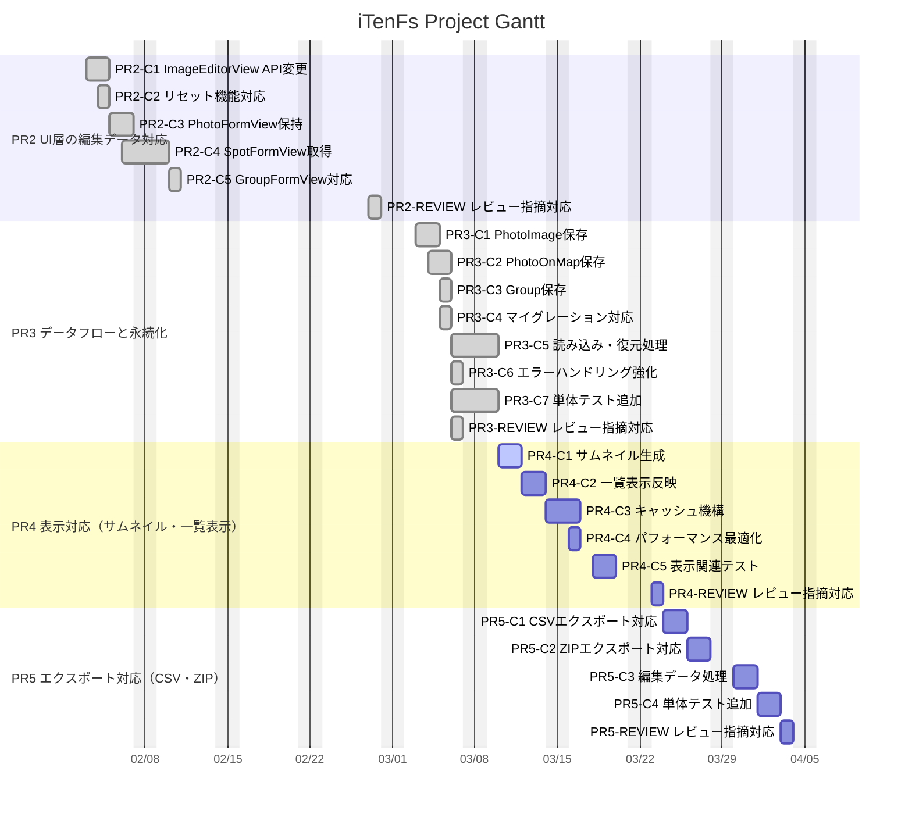

# 📊 iTenFs Gantt Chart

```mermaid
gantt
    title iTenFs Project Gantt
    dateFormat YYYY-MM-DD
    axisFormat %m/%d
    excludes weekends

    section PR2 UI層の編集データ対応
    PR2-C1 ImageEditorView API変更        :done,    pr2c1, 2026-02-03, 2d
    PR2-C2 リセット機能対応              :done,    pr2c2, 2026-02-04, 1d
    PR2-C3 PhotoFormView保持             :done,    pr2c3, 2026-02-05, 2d
    PR2-C4 SpotFormView取得              :done,    pr2c4, 2026-02-06, 2d
    PR2-C5 GroupFormView対応             :done,    pr2c5, 2026-02-10, 1d
    PR2-REVIEW レビュー指摘対応          :done,    pr2rev, 2026-02-27, 1d

    section PR3 データフローと永続化
    PR3-C1 PhotoImage保存                :done,    pr3c1, 2026-03-03, 2d
    PR3-C2 PhotoOnMap保存                :done,    pr3c2, 2026-03-04, 2d
    PR3-C3 Group保存                     :done,    pr3c3, 2026-03-05, 1d
    PR3-C4 マイグレーション対応          :done,    pr3c4, 2026-03-05, 1d
    PR3-C5 読み込み・復元処理            :done,    pr3c5, 2026-03-06, 2d
    PR3-C6 エラーハンドリング強化        :done,    pr3c6, 2026-03-06, 1d
    PR3-C7 単体テスト追加                :done,    pr3c7, 2026-03-06, 2d
    PR3-REVIEW レビュー指摘対応          :done,    pr3rev, 2026-03-06, 1d

    section PR4 表示対応（サムネイル・一覧表示）
    PR4-C1 サムネイル生成                :active,  pr4c1, 2026-03-10, 2d
    PR4-C2 一覧表示反映                  :         pr4c2, 2026-03-12, 2d
    PR4-C3 キャッシュ機構                :         pr4c3, 2026-03-14, 2d
    PR4-C4 パフォーマンス最適化          :         pr4c4, 2026-03-16, 1d
    PR4-C5 表示関連テスト                :         pr4c5, 2026-03-18, 2d
    PR4-REVIEW レビュー指摘対応          :         pr4rev, 2026-03-23, 1d

    section PR5 エクスポート対応（CSV・ZIP）
    PR5-C1 CSVエクスポート対応           :         pr5c1, 2026-03-24, 2d
    PR5-C2 ZIPエクスポート対応           :         pr5c2, 2026-03-26, 2d
    PR5-C3 編集データ処理                :         pr5c3, 2026-03-30, 2d
    PR5-C4 単体テスト追加                :         pr5c4, 2026-04-01, 2d
    PR5-REVIEW レビュー指摘対応          :         pr5rev, 2026-04-03, 1d
```