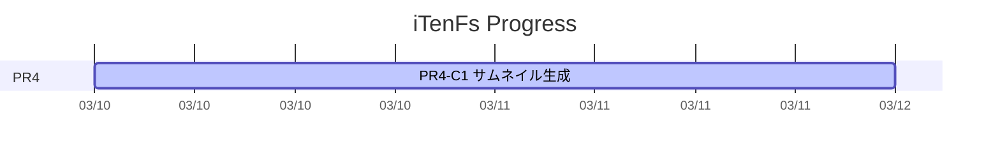

# 🚀 AI Project Management Operating Model
## Mermaid + YAML + Markdown による運用ガイド

---

# 🎯 目的

この運用モデルの目的は、Excel中心の進捗管理から脱却し、  
**AI と Git に適した形で、プロジェクト管理を構造化すること**です。

目指す状態は以下です。

- 📌 **YAML を真実のソースにする**
- 📌 **Mermaid は表示専用にする**
- 📌 **Markdown は判断・背景・意味を持つ**
- 📌 **AI が更新しやすく、人間も読める**
- 📌 **Git で差分が追いやすい**
- 📌 **将来の自動化に拡張しやすい**

---

# 🧠 基本思想

従来の Excel ガントは、見た目の一覧性は高い一方で、  
AI にとっては扱いづらく、Git 差分も読みにくいという課題があります。

そこで、管理対象を以下のように分離します。

## ✅ 管理対象の分離

- **WBS = 構造**
- **Schedule = 時間**
- **Progress = 事実**
- **Mermaid = 可視化**
- **Markdown = 意味・判断・背景**

この分離により、  
「見た目中心の管理」から「構造中心の管理」へ移行します。

---

# 🏗️ 推奨ディレクトリ構成

```text
docs/
  project-management/
    README.md
    00_overview.md
    10_wbs.yaml
    20_schedule.yaml
    30_progress.yaml
    40_gantt_mermaid.md
    50_status_report.md
    60_risks_issues.md
```

---

# 📂 各ファイルの役割

## `README.md`
### 📘 このディレクトリの入口

このファイルには以下を書きます。

- このディレクトリの目的
- 各ファイルの役割
- 更新ルール
- AI に何をさせるか
- 人間がどこを見ればよいか

> これは「案内板」です。  
> 個別の実データや進捗そのものは他ファイルに持たせます。

---

## `00_overview.md`
### 🗺️ プロジェクト全体の説明

ここには以下を記載します。

- プロジェクトの目的
- スコープ
- フェーズ全体像
- PR2 / PR3 / PR4 / PR5 の位置づけ
- 運用ポリシー
- この管理方式を採る理由

> 人間が全体像を把握するためのドキュメントです。

---

## `10_wbs.yaml`
### 🧱 作業分解構造（What）

ここでは「何をやるか」を管理します。

主に持つ情報:

- タスクID
- タスク名
- 親子関係
- 見積
- 完了条件
- 依存関係

例:

```yaml
wbs:
  - id: PR4
    name: 表示対応（サムネイル・一覧表示）
    children:
      - id: PR4-C1
        name: サムネイル生成ロジックの実装
        estimate_days: 2.0
```

> **WBS は構造の真実のソース**です。

---

## `20_schedule.yaml`
### 📅 スケジュール管理（When）

ここでは「いつやるか」「今どういう状態か」を管理します。

主に持つ情報:

- planned_start
- planned_end
- actual_start
- actual_end
- status
- owner

例:

```yaml
schedule:
  - id: PR4-C1
    planned_start: 2026-03-10
    planned_duration_days: 2.0
    actual_start: 2026-03-10
    status: doing
```

> **Schedule は時間の真実のソース**です。

---

## `30_progress.yaml`
### 📝 進捗の事実ログ（Fact）

ここでは、日々の進捗事実を記録します。

主に持つ情報:

- 日付
- 対象タスク
- 何をしたか
- 何が終わったか
- blocker
- 次アクション

例:

```yaml
progress_log:
  - date: 2026-03-11
    task_id: PR4-C1
    summary: サムネイル生成の復元処理を確認
    blockers:
      - キャッシュ戦略未確定
    next_actions:
      - 一覧表示と接続
```

> これは週報やステータス報告の材料になります。

---

## `40_gantt_mermaid.md`
### 📊 表示用ガントチャート

ここでは Mermaid による表示を持ちます。

役割はあくまで **可視化** です。



### 重要なルール
- 原則、ここを真実のソースにしない
- 予定・実績の元情報は YAML に置く
- Mermaid は表示専用と割り切る

> **図は真実ではなく、真実の投影**です。

---

## `50_status_report.md`
### 📣 人間向けステータス報告

ここには以下をまとめます。

- 今週の進捗
- 完了したこと
- 現在の課題
- 次のアクション
- 遅延や懸念

例:

```md
## 今週の進捗
- PR4-C1 を実装中
- 編集済み画像の表示フローを確認

## ブロッカー
- キャッシュ戦略未確定
```

> 会議・週報・共有用の読み物です。

---

## `60_risks_issues.md`
### ⚠️ リスク・論点・未解決事項管理

ここには以下を残します。

- 技術リスク
- 未確定仕様
- 意思決定待ち
- 性能懸念
- 将来の負債候補

例:

```md
## Risks
- 大量画像時にサムネイル生成が重くなる可能性
- キャッシュ戦略次第で整合性問題が発生する可能性

## Issues
- 非破壊編集データのサムネイル反映仕様が未確定
```

> ガントでは表現しきれない「不確実性」をここに逃がします。

---

# 🔑 運用ルール

## 1. YAML を真実のソースにする
Mermaid だけ更新して YAML が古い、を禁止します。

---

## 2. 状態値は固定する
状態は自由記述にしません。

```yaml
status_enum:
  - todo
  - doing
  - blocked
  - review
  - done
```

> AI が表現を揺らさないようにするためです。

---

## 3. 可能なら完了条件を持つ
各タスクに `definition_of_done` を入れます。

例:

```yaml
definition_of_done:
  - 表示される
  - クラッシュしない
  - テスト追加済み
```

> これにより、AI が「完了」の意味を誤解しにくくなります。

---

## 4. Mermaid は表示に徹する
Mermaid に背景説明や判断理由を詰め込まないようにします。

- 図 = 表示
- Markdown = 意味
- YAML = 構造・事実

この責務分離を守ります。

---

# 🤖 AI に任せる仕事

この構造にすると、AI に以下を任せやすくなります。

## ✅ 進捗更新
- `todo → doing → done`
- blocker の整理
- next action の更新

## ✅ ガント更新
- YAML をもとに Mermaid を更新
- 日付変更を反映
- 状態に応じて `done / active` を調整

## ✅ 週報生成
- `30_progress.yaml` をもとに `50_status_report.md` を更新

## ✅ リスク整理
- blocker から `60_risks_issues.md` を整理
- 遅延リスクを抽出

## ✅ 遅延分析
- 予定と実績のズレを説明
- 次フェーズへの影響を整理

---

# 👤 人間が担うべき役割

AI に任せる範囲が広がっても、人間の役割は非常に重要です。

## 人間が握るべきもの
- 目的
- 優先順位
- 完了条件
- 依存関係
- リスク判断
- スコープ調整

## AI に任せやすいもの
- 状態更新
- 形式変換
- ステータス要約
- ガント再生成
- 進捗レポート整形

> 人間は「判断」を握り、AI は「更新」と「整形」を担う構造です。

---

# 🪜 導入ステップ

最初から全部やる必要はありません。

## Phase 1
- `10_wbs.yaml`
- `20_schedule.yaml`

まずは構造と日程を分離する

## Phase 2
- `40_gantt_mermaid.md`

表示を作る

## Phase 3
- `50_status_report.md`

人間向け共有を整える

## Phase 4
- `30_progress.yaml`
- `60_risks_issues.md`

運用成熟後に追加する

---

# ✅ 初期段階の最小構成

最初はこの4つだけでも十分です。

```text
docs/project-management/
  README.md
  10_wbs.yaml
  20_schedule.yaml
  40_gantt_mermaid.md
  50_status_report.md
```

---

# 📌 ファイル名のおすすめ

## 入口ファイル
- `README.md` ← 推奨

## 詳細な運用思想を別ファイルにする場合
- `ai-project-management-operating-model.md`
- `project-management-operating-model.md`
- `ai-project-management-guide.md`

### おすすめ方針
- **ディレクトリの入口は `README.md`**
- **今回の説明のような詳細文書は別ファイル**

つまり最もおすすめなのはこうです。

```text
docs/project-management/
  README.md
  ai-project-management-operating-model.md
  00_overview.md
  10_wbs.yaml
  20_schedule.yaml
  30_progress.yaml
  40_gantt_mermaid.md
  50_status_report.md
  60_risks_issues.md
```

---

# 🎯 結論

この運用モデルの核心は次の一文に集約されます。

## **YAML を真実のソースとし、Mermaid は可視化、Markdown は意味を持つ**

この分離によって、

- ✨ AI が壊しにくい
- ✨ 人間が読みやすい
- ✨ Git 差分が追いやすい
- ✨ 将来の自動化に強い

という状態を作れます。

これは単なるガント管理ではなく、  
**AI時代のプロジェクト運用OS** として機能します。